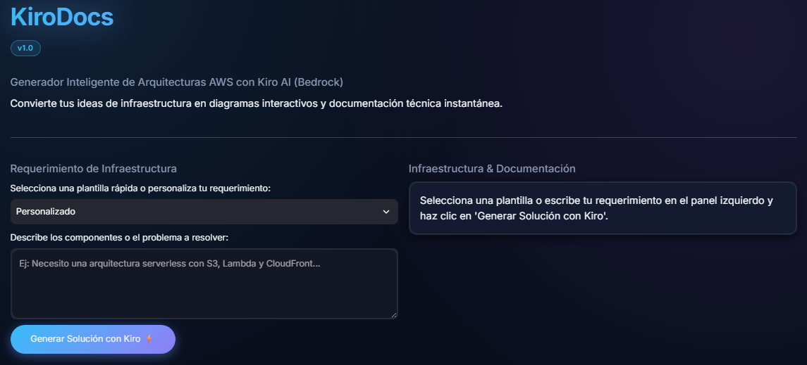
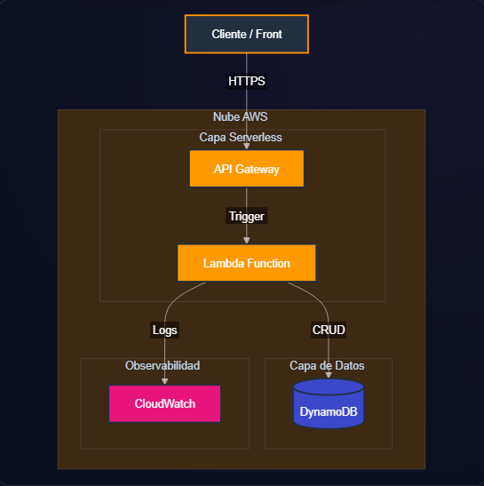
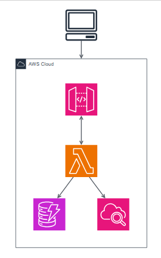

# KiroDocs — Agente Especializado de Arquitectura de Infraestructura en AWS

<p align="center">
  
  
  
  
  
  
</p>

<p align="center">
  <strong>Convierte requerimientos de infraestructura escritos en lenguaje natural en propuestas completas de arquitectura AWS, incluyendo diagramas, documentación técnica, Terraform y validaciones automáticas.</strong>
</p>

---

## KiroDocs en Acción

### 1. Pantalla Inicial
<p align="center">
  
</p>

> *Pantalla inicial de KiroDocs. El usuario selecciona una plantilla o describe su requerimiento en lenguaje natural antes de generar la propuesta de arquitectura.*

---

### 2. Flujo Completo de Generación
<p align="center">
  
</p>

> *Flujo completo de KiroDocs (29 s): desde la descripción del requerimiento hasta la generación de la arquitectura AWS, el diagrama Mermaid, la documentación técnica, el código Terraform y el análisis de seguridad.*

---

### 3. Resultado Final
<p align="center">
  
</p>

> *Resultado final generado por KiroDocs: propuesta de arquitectura, diagrama Mermaid, documentación técnica, código Terraform y validación automática de reglas de seguridad.*

---

## ¿Qué problema resuelve?

Diseñar y documentar una arquitectura en AWS suele tomar **días de trabajo manual**: reuniones para elegir servicios, un diagrama dibujado a mano, un README técnico escrito desde cero y, finalmente, el código de Terraform para desplegarlo. **KiroDocs automatiza ese proceso y permite generar una propuesta completa de arquitectura AWS en cuestión de segundos.**

Le describes tu necesidad en lenguaje natural — por ejemplo, *"necesito una API serverless con Lambda y DynamoDB"* — y KiroDocs entrega automáticamente, en un solo flujo:

- Un **diagrama de arquitectura** interactivo en sintaxis Mermaid.js.
- Un **resumen ejecutivo** con las decisiones de arquitecto tomadas.
- **Código Terraform generado automáticamente, listo para ser revisado, adaptado y desplegado.**
- La **trazabilidad completa del prompt** enviado al modelo de IA, para auditoría.

Todo esto generado por Amazon Bedrock a través de la API Converse de `boto3`, con salida forzada mediante *Tool Use* para garantizar que cada artefacto llegue completo y bien formado, sin necesidad de revisión manual del formato.

```
Requerimiento                  AWS Bedrock                  Salida generada
(Lenguaje Natural)  ───►  (Converse API + Tool Use)  ───►  ┌────────────────────────┐
                                                           │  | Diagrama Mermaid    │
                                                           │  | README Técnico      │
                                                           │  | Código Terraform    │
                                                           └────────────────────────┘
```

---

## Características Principales

- **Diagramas Interactivos:** Generación en tiempo real en sintaxis Mermaid.js renderizada directamente en la UI.
- **Especificación Técnica Completa:** Documentación técnica en Markdown lista para equipos de ingeniería.
- **Infraestructura como Código (IaC):** Código Terraform (`provider "aws"`) generado automáticamente para cada propuesta.
- **Generación mediante Bedrock:** Invocación avanzada de Amazon Bedrock a través de la Converse API con *Tool Use*.
- **Mecanismo de Resiliencia:** Continuidad del servicio garantizada ante restricciones temporales de cuota (`ThrottlingException`).
- **Auditoría y Observabilidad:** Panel de trazabilidad de llamadas a Bedrock y prompts estructurados en tiempo real.
- **Arquitecturas Explicables:** cada decisión de infraestructura incluye su correspondiente justificación técnica.
- **Construido con Kiro AI:** Integración de Agent Skills oficiales (`.kiro/skills/`) del Agent Toolkit for AWS.

---

## Tabla de Contenidos

- [¿Qué problema resuelve?](#-qué-problema-resuelve)
- [Características Principales](#-características-principales)
- [Visión General](#-visión-general)
- [El Rol de Kiro AI en el Desarrollo](#-el-rol-de-kiro-ai-en-el-desarrollo)
- [Arquitectura y Mecanismo de Resiliencia](#-arquitectura-y-mecanismo-de-resiliencia)
- [Stack Tecnológico y Uso de Amazon Bedrock](#-stack-tecnológico-y-uso-de-amazon-bedrock)
- [Flujo de trabajo](#flujo-de-trabajo)
- [Estructura del Repositorio](#-estructura-del-repositorio)
- [Guía de Instalación](#-guía-de-instalación)
- [Panel de Diagnóstico e Inspección en Tiempo Real](#-panel-de-diagnóstico-e-inspección-en-tiempo-real)
- [Consideraciones de Seguridad](#-consideraciones-de-seguridad)
- [Licencia](#-licencia)

---

## Visión General

**KiroDocs** es un agente inteligente impulsado por IA generativa que transforma requerimientos de software descritos en lenguaje natural en propuestas completas de infraestructura Cloud sobre AWS. En lugar de saltar directamente a escribir código de infraestructura, KiroDocs actúa como un Arquitecto de Soluciones AWS Certificado disponible bajo demanda: recibe la descripción del problema y entrega, en un solo flujo, todo lo que un equipo necesita para avanzar de la idea al despliegue.

Cada solicitud generada por KiroDocs produce cuatro artefactos coherentes entre sí:

- **Diagramas visuales interactivos** en sintaxis [Mermaid.js](https://mermaid.js.org/), renderizados directamente en la interfaz.
- **Documentación técnica detallada** en formato Markdown (README de la solución), con los servicios utilizados y las decisiones de arquitecto tomadas.
- **Código de Infraestructura como Código (IaC) en Terraform**. **Código Terraform generado automáticamente, listo para ser revisado, adaptado y desplegado.**
- **Trazabilidad completa del Prompt estructurado** enviado al modelo, incluyendo el prompt de sistema y el prompt de usuario, para auditoría y reproducibilidad.

El objetivo de KiroDocs no es solo generar texto plausible, sino garantizar una **salida estructurada y consistente** en cada ejecución, algo que se logra forzando al modelo de lenguaje a responder mediante `Tool Use` (function calling) en vez de texto libre — de esa forma, el diagrama, el README y el Terraform vienen siempre completos y bien formados, sin necesidad de parsear texto ambiguo.

---

## El Rol de Kiro AI en el Desarrollo

> **Enfoque de Desarrollo:** *KiroDocs no fue solo diseñado para utilizar IA generativa — fue construido utilizando Kiro AI como copiloto de ingeniería a lo largo de todo el ciclo de vida del proyecto.*

### Agent Skills que guiaron la construcción

El proyecto integra oficialmente el **[Agent Toolkit for AWS](https://docs.aws.amazon.com/agent-toolkit/latest/userguide/what-is-agent-toolkit.html)**, que da a Kiro acceso estructurado a documentación oficial de AWS y a *Agent Skills* curadas que guiaron directamente el diseño de la lógica de negocio, los prompts y la infraestructura generada por KiroDocs. Las skills se activan de forma automática cuando la tarea en curso coincide con su dominio:

| Skill | Cómo guió la construcción de KiroDocs |
|---|---|
| `amazon-bedrock` | Guió la invocación de modelos vía la Converse API, el diseño del esquema de `Tool Use` y el troubleshooting de errores como `ThrottlingException` y `AccessDeniedException` que dieron forma al mecanismo de resiliencia. |
| `aws-serverless` | Inspiró los patrones de Lambda, API Gateway y DynamoDB usados como base en las plantillas rápidas y en la Arquitectura de Continuidad servida en Modo de Continuidad del Servicio. |
| `aws-sdk-python-usage` | Definió las convenciones de boto3/botocore aplicadas en el código: manejo de clientes, excepciones (`ClientError`, `BotoCoreError`) y buenas prácticas de SDK en Python. |
| `aws-iam` | Guió el principio de mínimo privilegio reflejado en las recomendaciones de seguridad que KiroDocs incluye en cada propuesta generada. |
| `signing-in-to-aws` | Guió el diagnóstico de problemas de credenciales y autenticación local con AWS, reflejado en los mensajes de error de la aplicación. |

### Contribuciones concretas de Kiro al proyecto

- **Diseño del prompt de sistema y del esquema de `Tool Use`**: Kiro ayudó a estructurar el prompt de sistema y la herramienta forzada para que el modelo actúe consistentemente como Arquitecto de Soluciones AWS y devuelva siempre un JSON válido con las seis secciones requeridas (resumen ejecutivo, diagrama, servicios, README, Terraform y seguridad).
- **Integración con la Converse API de Amazon Bedrock**: implementación de la generación de arquitecturas con salida forzada mediante Tool Use, evitando el parseo frágil de texto libre.
- **Diseño e implementación del Mecanismo de Resiliencia**: la cadena de reintentos entre modelos y el Modo de Continuidad del Servicio (detallados en la siguiente sección) fueron iterados junto con Kiro para cubrir escenarios reales de cuota y throttling en Bedrock.
- **Estilizado de la interfaz**: el tema "AWS Dark / Neón" (tipografía Google Fonts, gradientes cian-violeta, efecto *glassmorphism*, pill-tabs y glow en el botón principal) fue diseñado e implementado de forma iterativa con Kiro, separando completamente el CSS de la lógica de la aplicación.
- **Endurecimiento del manejo de errores**: distinción clara entre errores de credenciales, de red y de servicio, con mensajes orientados al usuario final en cada caso.

### Apéndice: Detalles de Implementación con Kiro

Referencia técnica de los archivos y funciones concretas que Kiro ayudó a construir, para quien quiera inspeccionar el código directamente:

- **Conexión al AWS MCP Server**: configurada en `.kiro/settings/mcp.json` mediante `mcp-proxy-for-aws`, permitiendo a Kiro consultar documentación oficial de AWS en tiempo real durante el desarrollo, sin depender únicamente de su conocimiento de entrenamiento.
- **Skills instaladas localmente**: viven en `.kiro/skills/` (una carpeta por skill: `amazon-bedrock/`, `aws-serverless/`, `aws-sdk-python-usage/`, `aws-iam/`, `signing-in-to-aws/`), con su registro de versiones en `skills-lock.json`.
- **Esquema de `Tool Use`**: definido en `TOOL_SPEC` dentro de `app.py`, junto con `SYSTEM_PROMPT` como prompt de sistema.
- **Llamada a Bedrock**: implementada en la función `generar_arquitectura()`, que usa `boto3.client("bedrock-runtime").converse()` con `toolConfig` y `toolChoice` forzado.
- **Mecanismo de Resiliencia**: implementado en `generar_arquitectura_con_fallback()`, con el Modo de Continuidad del Servicio resuelto por `generar_respuesta_demo()`.
- **Estilos**: separados en `styles.css` e inyectados en `app.py` mediante la función `cargar_css()`.
- **Manejo de errores**: distinción explícita entre `NoCredentialsError`, `EndpointConnectionError` y los distintos códigos de `ClientError` dentro del flujo principal de `app.py`.

---

## Arquitectura y Mecanismo de Resiliencia

### Arquitectura de Referencia AWS

<p align="center">
  
</p>

> **Nota sobre los diagramas:** La siguiente imagen representa la **arquitectura de referencia** oficial utilizada como respaldo en el Modo de Continuidad. Los diagramas generados dinámicamente por la aplicación mediante Amazon Bedrock se adaptan al requerimiento específico del usuario y se renderizan de forma interactiva en Mermaid.js directamente en la interfaz.

Los modelos de Amazon Bedrock, especialmente bajo cuota de cuenta nuevas o en regiones con alta demanda, pueden rechazar solicitudes con errores como `ThrottlingException` o `AccessDeniedException`. Un agente de arquitectura que se cae ante el primer error de cuota no es utilizable en un entorno real ni demostrable de forma confiable frente a un jurado — por eso KiroDocs integra un **Mecanismo de Resiliencia de nivel de producción**, con reintentos en cascada entre modelos.

### Cómo funciona

```
Usuario solicita arquitectura
        │
        ▼
┌───────────────────────────────┐
│ Intento 1: Modelo seleccionado│───► Éxito ──► Respuesta al usuario
└───────────────────────────────┘
        │ ThrottlingException / AccessDeniedException / ClientError
        ▼
┌───────────────────────────────┐
│ Intento 2..N: Modelos restantes│──► Éxito ──► Respuesta al usuario
│ de MODELOS_DISPONIBLES         │      + aviso del modelo alternativo usado
└───────────────────────────────┘
        │ Todos los modelos fallan
        ▼
┌───────────────────────────────┐
│ MODO DE CONTINUIDAD DEL       │
│ SERVICIO                      │
│ Arquitectura de Continuidad   │
│ generada + panel de auditoría │
│ de resiliencia                │
└───────────────────────────────┘
```

La función `generar_arquitectura_con_fallback()` implementa esta cadena:

1. **Intento primario**: se invoca el modelo elegido por el usuario en el panel lateral.
2. **Reintento automático entre modelos**: si el modelo primario falla por cualquier excepción de `ClientError`, `BotoCoreError` o `ValueError` (respuesta mal formada), KiroDocs prueba automáticamente con el siguiente modelo disponible en `MODELOS_DISPONIBLES`, sin exponer un error crudo al usuario.
3. **Modo de Continuidad del Servicio**: si **todos** los modelos configurados fallan (el escenario típico de una cuenta nueva de AWS esperando la aprobación de un ticket de aumento de cuota), la aplicación **no colapsa ni interrumpe la experiencia del usuario**. En su lugar:
   - Genera localmente, sin llamadas de red, una **Arquitectura de Continuidad** (API Gateway + Lambda + DynamoDB + CloudWatch) con el mismo esquema estructurado que produciría Bedrock.
   - Muestra el aviso: *"Modo de Continuidad Activo: Ante restricciones temporales de cuota en Amazon Bedrock, KiroDocs activa automáticamente su mecanismo de resiliencia para proporcionar una arquitectura de referencia y garantizar la continuidad del servicio."*
   - Despliega un **panel de auditoría de resiliencia** expandible, con la traza exacta de cada intento fallido: modelo evaluado y código/mensaje de error de AWS, permitiendo distinguir de inmediato si el problema es de cuota, de permisos IAM o de conectividad.

Este diseño garantiza que KiroDocs **siempre tiene algo funcional que mostrar**, incluso si las credenciales de AWS del entorno todavía no tienen acceso aprobado a los modelos de Bedrock — una situación común en cuentas recién creadas para un hackathon.

---

## Stack Tecnológico y Uso de Amazon Bedrock

| Capa | Tecnología |
|---|---|
| **Lenguaje** | Python 3.11 |
| **Frontend / UI** | [Streamlit](https://streamlit.io/) con interfaz personalizada estilo **AWS Dark / Neón**: tipografía Google Fonts (*Plus Jakarta Sans* + *Inter*), gradiente cian–violeta con efecto *glow*, tarjetas y sidebar con *glassmorphism* (`backdrop-filter: blur`), y pestañas estilo cápsula (*pill tabs*) |
| **IA & LLMs** | **Amazon Bedrock**, invocado mediante la **API Converse** de `boto3` (`boto3.client("bedrock-runtime").converse`), con salida forzada mediante **Tool Use / Function Calling** (`toolConfig` + `toolChoice`) para solicitar respuestas estructuradas mediante Tool Use |
| **Modelos invocados** | Familia **Amazon Nova** (Nova Lite, Nova Pro, Nova Micro) y **Anthropic Claude** (Claude 3 Haiku), todos accesibles vía *inference profiles* cross-region (`us.*`) sobre el mismo cliente `bedrock-runtime` |
| **Infraestructura generada** | Terraform (`provider "aws" ~> 5.0`) y diagramas en sintaxis Mermaid.js |
| **SDK de AWS** | [boto3](https://boto3.amazonaws.com/v1/documentation/api/latest/index.html) / botocore, con manejo explícito de `ClientError`, `BotoCoreError`, `NoCredentialsError` y `EndpointConnectionError` |
| **Agent Tooling** | [Agent Toolkit for AWS](https://docs.aws.amazon.com/agent-toolkit/latest/userguide/what-is-agent-toolkit.html) — AWS MCP Server + Agent Skills en `.kiro/skills/` |

### Cómo se usa Amazon Bedrock en KiroDocs

Cada generación de arquitectura se resuelve con una sola llamada a la **Converse API**, la interfaz unificada de Amazon Bedrock que funciona igual sin importar qué modelo esté detrás (Nova o Claude). KiroDocs no pide texto libre al modelo: declara una herramienta (`generar_documentacion_arquitectura`) con un esquema JSON estricto y fuerza al modelo a invocarla mediante `toolChoice`, garantizando que el diagrama, el README, el Terraform y las consideraciones de seguridad lleguen siempre completos en la misma respuesta.

> **Nota:** la lista de modelos en `MODELOS_DISPONIBLES` puede ajustarse a los modelos que tu cuenta de AWS tenga habilitados en *Model access* de Amazon Bedrock. El script `listar_modelos.py` incluido en el repositorio consulta en tiempo real qué modelos están activos e invocables en tu región mediante `bedrock:ListFoundationModels`.

---

## Flujo de trabajo

1. **Entrada de requerimiento:** El usuario describe la infraestructura en lenguaje natural y ajusta parámetros (modelo, región, temperatura).
2. **Invocación estructurada:** KiroDocs envía la solicitud a Amazon Bedrock mediante la Converse API con salida forzada por *Tool Use*.
3. **Procesamiento y parseo:** El modelo responde garantizando un esquema JSON estricto.
4. **Generación de artefactos:** La interfaz presenta el resumen ejecutivo, diagrama Mermaid renderizado, especificación Markdown y código Terraform.
5. **Mecanismo de continuidad:** Si los modelos de Bedrock presentan restricciones temporales, el sistema activa automáticamente el Modo de Continuidad del Servicio con auditoría visual.

---

## Estructura del Repositorio

```text
KiroDocs/
├── app.py                     # Aplicación Streamlit principal (UI + Amazon Bedrock + Mecanismo de Resiliencia)
├── styles.css                 # Estilos AWS Dark / Neón (glassmorphism, pill tabs, glow)
├── docs/                      # Capturas y recursos gráficos de la documentación
│   └── kirodocs-main.png      # Captura de pantalla principal de la aplicación
├── listar_modelos.py           # Script de diagnóstico: lista modelos activos e invocables en Bedrock
├── requirements.txt            # Dependencias Python (streamlit, boto3)
├── skills-lock.json             # Registro de versiones/hashes de las Agent Skills instaladas
├── LICENSE                      # Licencia MIT
├── .kiro/
│   ├── settings/
│   │   └── mcp.json            # Configuración del AWS MCP Server (mcp-proxy-for-aws)
│   └── skills/                  # Agent Skills oficiales de AWS instaladas localmente
│       ├── amazon-bedrock/
│       ├── aws-serverless/
│       ├── aws-sdk-python-usage/
│       ├── aws-iam/
│       └── signing-in-to-aws/
├── .devcontainer/
│   └── devcontainer.json       # Configuración de entorno para GitHub Codespaces
└── README.md                    # Este documento
```

---

## Guía de Instalación

### Prerrequisitos

- Python 3.11 o superior.
- Una cuenta de AWS con acceso habilitado a Amazon Bedrock y a los modelos que desees usar (**Model access** en la consola de Bedrock).
- Credenciales de AWS con el permiso `bedrock:InvokeModel` sobre los modelos configurados.

### 1. Clonar el repositorio

```bash
git clone https://github.com/<tu-usuario>/KiroDocs.git
cd KiroDocs
```

### 2. Crear un entorno virtual e instalar dependencias

```bash
python -m venv venv
source venv/bin/activate      # En Windows: venv\Scripts\activate

pip install -r requirements.txt
```

### 3. Configurar las credenciales de AWS

KiroDocs usa la cadena de resolución de credenciales estándar de `boto3`. La forma más simple es exportar variables de entorno:

```bash
export AWS_ACCESS_KEY_ID="tu_access_key_id"
export AWS_SECRET_ACCESS_KEY="tu_secret_access_key"
export AWS_DEFAULT_REGION="us-east-1"
```

En Windows (PowerShell):

```powershell
$env:AWS_ACCESS_KEY_ID="tu_access_key_id"
$env:AWS_SECRET_ACCESS_KEY="tu_secret_access_key"
$env:AWS_DEFAULT_REGION="us-east-1"
```

También puedes usar un perfil de AWS CLI (`aws configure`) en lugar de variables de entorno; boto3 lo detectará automáticamente.

> **Seguridad:** nunca subas tus credenciales de AWS al repositorio. Si usas un archivo `.env`, asegúrate de incluirlo en `.gitignore`.

### 4. (Opcional) Verificar qué modelos tienes disponibles

```bash
python listar_modelos.py us-east-1
```

Este script lista los modelos activos e invocables (`ON_DEMAND` o `INFERENCE_PROFILE`) en la región indicada, para confirmar cuáles usar en `MODELOS_DISPONIBLES`.

### 5. Ejecutar la aplicación localmente

```bash
streamlit run app.py
```

La aplicación quedará disponible en `http://localhost:8501`. Desde el panel lateral podrás seleccionar el modelo de Bedrock, la región de AWS y los parámetros de inferencia (temperatura y tokens máximos) antes de generar tu primera arquitectura.

---

## Panel de Diagnóstico e Inspección en Tiempo Real

KiroDocs no solo genera arquitecturas: también expone la trazabilidad completa de cómo llegó a esa respuesta, algo esencial tanto para depuración en producción como para evaluación técnica del proyecto.

Cada vez que se genera una solución, la interfaz ofrece:

- **Pestaña "Prompt de Kiro"**: muestra el modelo exacto que finalmente respondió (que puede ser un modelo alternativo distinto al seleccionado originalmente), su identificador técnico completo, el `SYSTEM_PROMPT` enviado y el prompt de usuario estructurado — permitiendo auditar exactamente qué se le pidió al modelo.
- **Aviso de modelo alternativo**: si el modelo principal falló y se usó un modelo alternativo con éxito, se muestra de forma explícita cuál era el modelo que falló, el código/mensaje de error de AWS, y cuál modelo alternativo respondió correctamente.
- **Panel de auditoría de resiliencia**: cuando se activa el Modo de Continuidad del Servicio, un `st.expander` titulado *"Ver auditoría de resiliencia"* despliega el detalle de **cada intento fallido**, uno por modelo, con su código de error de AWS (por ejemplo `ThrottlingException` o `AccessDeniedException`) y su mensaje descriptivo — la traza exacta de la API que desencadenó la activación del mecanismo de resiliencia.
- **Manejo diferenciado de errores de conectividad**: KiroDocs distingue explícitamente entre ausencia de credenciales (`NoCredentialsError`), problemas de red (`EndpointConnectionError`) y errores propios del servicio (`ClientError`), mostrando en cada caso un mensaje orientado a la causa raíz en vez de un stack trace genérico.

Este nivel de observabilidad convierte a KiroDocs en algo más que un generador de contenido: es un agente que expone su propio comportamiento operativo, en línea con las prácticas de resiliencia y observabilidad recomendadas por el AWS Well-Architected Framework.

---

## Consideraciones de Seguridad

- La aplicación **no incluye autenticación propia**. Si se despliega públicamente, cualquier persona con acceso a la URL podría generar llamadas a Amazon Bedrock usando las credenciales configuradas en el servidor, incurriendo en costos. Se recomienda agregar un mecanismo de autenticación (por ejemplo, contraseña vía `st.secrets`) antes de exponer la app fuera de un entorno controlado.
- Las credenciales de AWS **nunca** deben hardcodearse en el código ni subirse al repositorio; usa variables de entorno, perfiles de AWS CLI o roles de IAM.
- Toda propuesta de arquitectura generada por KiroDocs incluye recomendaciones de seguridad (principio de mínimo privilegio en IAM, cifrado en reposo, segmentación de red), pero estas son sugerencias de un modelo generativo y deben ser revisadas por un arquitecto humano antes de desplegarse en producción.

---

## Licencia

Este proyecto se distribuye bajo la licencia **MIT**. Consulta el archivo `LICENSE` para más detalles.

---

*Este proyecto fue desarrollado como parte del Hackathon IA Masivo Online AWS por Código Facilito, explorando el uso de Kiro AI y Amazon Bedrock para automatizar el diseño de arquitecturas cloud.*

<p align="center">
  Construido utilizando <strong>Kiro AI</strong> para el Hackathon de Código Facilito y AWS.
</p>
